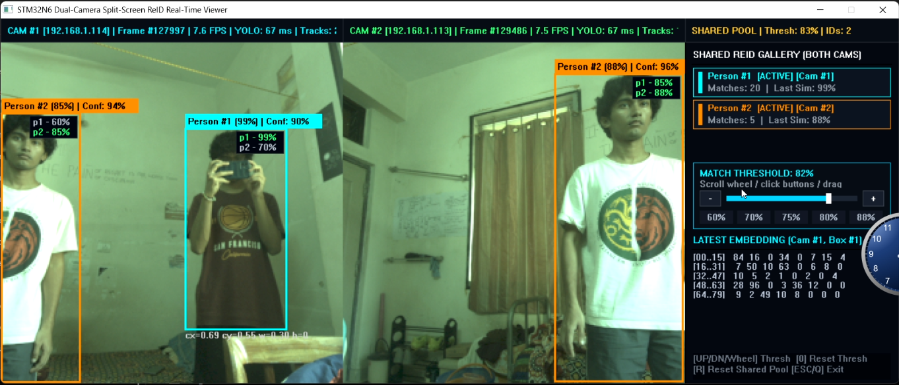

# Project Argus: Distributed Edge AI Multi-Camera Spatial Intelligence System

[](https://www.st.com/en/evaluation-tools/stm32n6570-dk.html)
[-orange.svg)](https://www.tron.org/)
[](https://www.st.com/)
[](https://savannah.nongnu.org/projects/lwip/)

---
Demo Video: [https://youtu.be/DKi3cbAR6Gw](https://youtu.be/DKi3cbAR6Gw)

## 1. About

**Project Argus** is a distributed, multi-camera spatial intelligence system that moves deep learning directly to the extreme edge. Running on ultra-low-power **STM32N6570-DK** microcontrollers, each camera node captures video, detects objects, and extracts deep feature embeddings locally in real time.

By performing complete vision inference on-device, Project Argus eliminates cloud bandwidth bottlenecks, removes cloud compute costs, provides zero-latency alerts, and guarantees privacy by design, streaming only lightweight detections and feature vectors rather than sensitive raw video feeds.

<p align="center">
  
</p>

### Key Capabilities

1. **Hard Real-Time System with TRON μT-Kernel 3.0**:
   - Built on the microT-Kernel 3.0 (`mtk3_bsp2`) RTOS compliant with TRON Forum standards.
   - Provides deterministic, preemptive scheduling to guarantee zero frame dropping across MIPI-CSI2 acquisition, DMA transfers, NPU execution, and high-speed network transmission.

2. **Deep Feature Extraction**:
   - Executes specialized feature extraction neural networks on the integrated **Neural-ART NPU**.
   - Generates compact, high-dimensional appearance descriptors for real-time person re-identification across non-overlapping camera fields of view.

3. **On-Device Object Detection**:
   - Performs real-time target and person localization directly on sensor frames captured by the MIPI-CSI2 camera and DCMIPP ISP pipeline.

---

## 2. System Architecture

<p align="center">
  
</p>

---

## 3. Hardware & Network Topology Setup

> [!NOTE]
> **Current Execution Mode**: The project currently runs reliably in **Debug Mode** via STM32CubeIDE. There is an active memory security/isolation attribute conflict under investigation in the standalone external flash Load-and-Run (LRUN) execution path causing FSBL standalone boots to crash. This will be updated as soon as resolved.
> For the evaluation setup, connect each STM32 board to a separate laptop (or two dedicated USB debug ports on the same host). One of the laptops also acts as the central server host.

### Physical Connections
1. **STM32 Board 1**:
   - Plug an RJ45 Ethernet patch cable from Board 1 into **Port 1** of the dedicated Ethernet switch.
   - Connect the board's ST-LINK USB-C port to Laptop A for debugging and power.
2. **STM32 Board 2**:
   - Plug an RJ45 Ethernet patch cable from Board 2 into **Port 2** of the Ethernet switch.
   - Connect the board's ST-LINK USB-C port to Laptop B for debugging and power.
3. **Server Laptop (Host PC)**:
   - Connect Laptop A's RJ45 Ethernet port (or a Gigabit USB-to-Ethernet adapter) into **Port 3** of the Ethernet switch.

### Windows Static IP Configuration

The embedded nodes transmit telemetry over the `192.168.1.x` subnet (`255.255.255.0`). Configure the server laptop with a static IP (`192.168.1.100`):

#### Method A: Using PowerShell (Fastest)
1. Press `Win + X` and select **Terminal (Admin)** or **Windows PowerShell (Admin)**.
2. Run the following command to identify your Ethernet interface name:
   ```powershell
   Get-NetAdapter | Where-Object { $_.Status -eq "Up" }
   ```
3. Assign the static IP (replace `"Ethernet"` with your adapter name if different):
   ```powershell
   New-NetIPAddress -InterfaceAlias "Ethernet" -IPAddress 192.168.1.100 -PrefixLength 24 -DefaultGateway 192.168.1.1
   ```
4. Verify the assigned configuration:
   ```powershell
   Get-NetIPAddress -InterfaceAlias "Ethernet" -AddressFamily IPv4
   ```

#### Method B: Using Windows Settings GUI
1. Open Windows **Settings** (`Win + I`) -> **Network & internet** -> **Ethernet**.
2. Under **IP assignment**, click **Edit**.
3. Change the dropdown from **Automatic (DHCP)** to **Manual**, and toggle **IPv4** to **On**.
4. Enter the following parameters:
   - **IP address**: `192.168.1.100`
   - **Subnet mask**: `255.255.255.0` (or Subnet prefix length: `24`)
   - **Gateway**: `192.168.1.1`
   - **Preferred DNS**: `8.8.8.8` (or leave empty)
5. Click **Save**.

---

## 4. Evaluation Guide (Step-by-Step for Judges)

### Step 1: Launch the Central Aggregator Server

The central tracking and multi-camera display server is located in:
👉 [Project-Argus---Server Repository](https://github.com/Shishir-Hegde/Project-Argus---Server)

1. Clone or pull the latest server repository on the server laptop:
   ```cmd
   git clone https://github.com/Shishir-Hegde/Project-Argus---Server.git
   cd Project-Argus---Server
   git pull origin main
   ```
2. Build and run the server using the automated script:
   ```cmd
   build_and_run.bat
   ```
   *Alternatively, run the precompiled executable directly:*
   ```cmd
   Project-Argus-Server.exe
   ```
3. The server application window opens and listens on UDP port 5000 for incoming camera frames and bounding box vectors.

---

### Step 2: Flash the AI Models (STM32CubeProgrammer)

Program the neural network model weights to the board's external flash memory using **STM32CubeProgrammer**:

1. Open **STM32CubeProgrammer** and click **Connect**.
2. In the left panel, click the **External Loaders** icon and check `MX66UW1G45G_STM32N6570-DK`.
3. In the **Erasing & Programming** tab, browse for each model file, set the corresponding target address, and click **Start Programming**:
   - **Object Detection Model**: `0x71000000`
   - **Feature Extraction Model**: `0x71400000`
4. Disconnect STM32CubeProgrammer once programming verifies successfully.

---

### Step 3: Configure STM32 Hardware Boot Switches (Debug Mode)

Ensure the dual DIP boot switches on each STM32 board are set to **Development / Debug Mode**:
- Set switch positions **BOOT0** and **BOOT1** to **0**.
- Connect the ST-LINK USB-C cable to supply power and open debug access.

---

### Step 4: Open and Run Firmware via STM32CubeIDE

1. Clone the Project Argus firmware repository:
   ```cmd
   git clone https://github.com/Shiken56/Project-Argus.git
   cd Project-Argus
   git pull origin main
   ```
2. Open **STM32CubeIDE** (version 2.0 or newer).
3. Select **File -> Open Projects from File System...**, browse to the cloned folder, and import the workspace.
4. You will see two sub-projects in the Project Explorer:
   - `mtk3bsp2_stm32n657_FSBL` (First Stage Bootloader)
   - `mtk3bsp2_stm32n657_Appli` (Application: TRON RTOS + Edge AI + LwIP)

> [!IMPORTANT]
> **Launch Sequence**:
> You **MUST** start the debug session on **`mtk3bsp2_stm32n657_FSBL`**.
> The STM32N6 requires FSBL to initialize the Resource Isolation Framework (RIF / RIMC / RISC), bus clocks, and peripheral security domains before jumping to the microT-Kernel application inside AXISRAM (`0x34000000`).

5. Right-click on **`mtk3bsp2_stm32n657_FSBL`** -> **Debug As** -> **STM32 C/C++ Application**.
6. When the debugger halts at `main()` in FSBL, press **Resume (F8)**.
7. Repeat the same launch sequence on the second laptop for Board 2.

---

## 5. Output

<p align="center">
  
</p>

1. **Serial Console Output**:
   - Open a serial terminal (PuTTY / TeraTerm / Minicom) on the virtual COM port at **115200 baud, 8-N-1**.
   - The boot output confirms microT-Kernel initialization, link negotiation, and NPU model activation:
     ```text
     [SYS] microT-Kernel 3.0 Booted Successfully
     [ETH] Link Up: 1000 Mbps Full Duplex
     [AI] Neural-ART NPU Initialized
     [AI] Detection & ReID Feature Pipeline Active
     [NET] Streaming Telemetry & Visual Stream to 192.168.1.100...
     ```
2. **Server Viewer Window**:
   - The server UI displays the live camera stream panels from the edge nodes.
   - Bounding boxes outline detected targets in real time.
   - ReID feature vectors match subjects across the camera views to maintain continuous identity tracking.


---

## 6. Troubleshooting Checklist

| Issue | Root Cause | Solution |
| :--- | :--- | :--- |
| **No packets received on Server** | Laptop IP misconfigured | Verify the Ethernet adapter is statically set to `192.168.1.100` with subnet mask `255.255.255.0`. Verify settings by running `ipconfig` in command prompt. |
| **Camera Warning / No Frame Received** | CSI flex ribbon cable loose | Disconnect power, reseat the MIPI-CSI camera ribbon cable firmly into the board socket, and lock the latch. |
| **Appli does not boot** | Started without FSBL | Launch the debugger targeting **`FSBL`** so clocks and isolation domains initialize first. |
| **ST-LINK not detected** | ST-LINK USB driver missing | Install the ST-LINK USB driver provided with STM32CubeIDE or STM32CubeProgrammer. |

---

## 7. Project Repositories & Resources

- **Firmware Repository**: [https://github.com/Shiken56/Project-Argus](https://github.com/Shiken56/Project-Argus)
- **Aggregator Server Repository**: [https://github.com/Shishir-Hegde/Project-Argus---Server](https://github.com/Shishir-Hegde/Project-Argus---Server)
- **TRON Forum Specifications**: [https://www.tron.org/](https://www.tron.org/)
