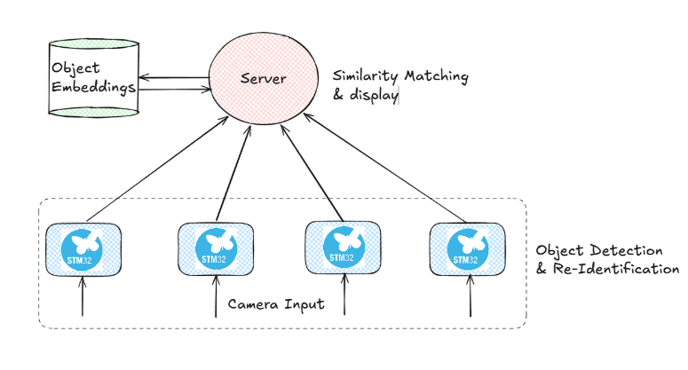
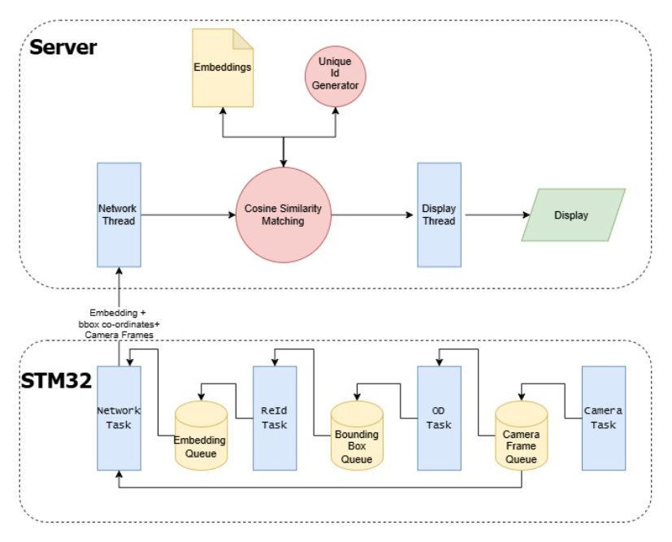

# Project Argus: Distributed Edge AI Multi-Camera Spatial Intelligence System

[](https://www.st.com/en/evaluation-tools/stm32n6570-dk.html)
[-orange.svg)](https://www.tron.org/)
[](https://www.st.com/)
[](https://savannah.nongnu.org/projects/lwip/)

---

## 1. About

**Project Argus** is a distributed, multi-camera spatial intelligence system that moves deep learning directly to the extreme edge. Running on ultra-low-power **STM32N6570-DK** microcontrollers, each camera node captures video, detects objects, and extracts deep feature embeddings locally in real time. 

By performing complete vision inference on-device, Project Argus eliminates cloud bandwidth bottlenecks, removes cloud compute costs, provides zero-latency alerts, and guarantees privacy by design—streaming only lightweight detections and feature vectors rather than sensitive raw video feeds.

<p align="center">
  
</p>

### Key Capabilities

1. **Hard Real-Time System with TRON μT-Kernel 3.0**:
   - Built on the microT-Kernel 3.0 (`mtk3_bsp2`) RTOS compliant with TRON Forum standards.
   - Provides deterministic, preemptive scheduling to guarantee zero frame dropping across MIPI-CSI2 acquisition, DMA transfers, NPU execution, and high-speed network transmission.

2. **Deep Feature Extraction (ReID Embeddings)**:
   - Executes specialized feature extraction neural networks on the integrated **Neural-ART NPU**.
   - Generates compact, high-dimensional appearance descriptors for real-time person re-identification across non-overlapping camera fields of view.

3. **On-Device Object Detection**:
   - Performs real-time target and person localization directly on sensor frames captured by the MIPI-CSI2 camera and DCMIPP ISP pipeline.

---

## 2. System Architecture

<p align="center">
  
</p>


---

## 3. Hardware & Network Topology Setup

### Physical Connections
1. **STM32 Board 1**:
   - Connect the board's RJ45 Ethernet port to **Port 1** of the Ethernet switch.
   - Connect the board's ST-LINK USB-C port to the evaluation laptop.
2. **STM32 Board 2**:
   - Connect the board's RJ45 Ethernet port to **Port 2** of the Ethernet switch.
   - Connect the board's ST-LINK USB-C port to the evaluation laptop (or a second USB port).
3. **Evaluation Laptop (Host Server)**:
   - Connect the laptop's RJ45 Ethernet port (or USB-to-Ethernet adapter) to **Port 3** of the Ethernet switch.

### Laptop Static IP Configuration
The embedded boards communicate over the `192.168.1.0/24` subnet. Configure your laptop's Ethernet adapter with a static IP:

- **IP Address**: `192.168.1.100`
- **Subnet Mask**: `255.255.255.0`
- **Default Gateway**: `192.168.1.1` (or leave empty)

#### PowerShell Setup Command (Run as Administrator):
```powershell
New-NetIPAddress -InterfaceAlias "Ethernet" -IPAddress 192.168.1.100 -PrefixLength 24
```

---

## 4. Evaluation Guide (Step-by-Step for Judges)

### Step 1: Launch the Central Aggregator Server

The central tracking and multi-camera display server is hosted in its dedicated repository:
👉 [Project-Argus---Server Repository](https://github.com/Shishir-Hegde/Project-Argus---Server)

1. Clone or pull the latest server repository on the evaluation laptop:
   ```cmd
   git clone https://github.com/Shishir-Hegde/Project-Argus---Server.git
   cd Project-Argus---Server
   git pull origin main
   ```
2. Build and launch the server using the provided automation script:
   ```cmd
   build_and_run.bat
   ```
   *Alternatively, run the precompiled executable directly:*
   ```cmd
   Project-Argus-Server.exe
   ```
3. The server application window will initialize and listen on UDP for incoming edge camera streams and telemetry vectors.

---

### Step 2: Flash the AI Models (STM32CubeProgrammer)

Use **STM32CubeProgrammer** to program the neural network models to external flash:

1. Open **STM32CubeProgrammer** and click **Connect**.
2. Select and enable the **External Memory Loader** for the board: `MX66UW1G45G_STM32N6570-DK`.
3. In the **Erasing & Programming** tab, browse and select the model HEX/bin file, enter the respective address, and click **Start Programming**:
   - **Object Detection Model**: `0x71000000`
   - **Feature Extraction (ReID) Model**: `0x71400000`

---

### Step 3: Configure STM32 Hardware Boot Switches (Debug Mode)

Before connecting the boards, ensure the boot switches are configured in **Development / Debug Mode**:
- Set both boot switch positions (**BOOT0** and **BOOT1**) to **0 / Development Boot Mode**.
- Connect the ST-LINK USB-C cable to power the board and enable JTAG/SWD debugging.

---

### Step 4: Open and Run Firmware via STM32CubeIDE

1. Clone the Project Argus firmware repository:
   ```cmd
   git clone https://github.com/Shiken56/Project-Argus.git
   cd Project-Argus
   git pull origin main
   ```
2. Launch **STM32CubeIDE** (version 2.0 or newer).
3. Select **File -> Open Projects from File System...**, browse to the cloned directory, and import the project.
4. You will see two sub-projects in the Project Explorer:
   - `mtk3bsp2_stm32n657_FSBL` (First Stage Bootloader)
   - `mtk3bsp2_stm32n657_Appli` (Application: TRON RTOS + Edge AI + LwIP)

> [!IMPORTANT]
> **Execution Order is Critical:**
> You **MUST** start debugging from **`mtk3bsp2_stm32n657_FSBL`**. 
> - The STM32N6 relies on the First Stage Bootloader to configure the Resource Isolation Framework (RIF / RIMC / RISC), clock distributions, and security attributes.
> - Once FSBL runs, it initializes system isolation and smoothly branches execution into the microT-Kernel application inside AXISRAM (`0x34000000`).

5. Right-click on **`mtk3bsp2_stm32n657_FSBL`** -> **Debug As** -> **STM32 C/C++ Application**.
6. When the debugger hits `main()` in FSBL, click **Resume (F8)**.
7. Repeat the launch for the second board connected via the second ST-LINK instance.

---

## 5. Verification & Runtime Output

1. **Serial Console Verification**:
   - Open a serial terminal (PuTTY / TeraTerm / Minicom) on the virtual COM port at **115200 baud, 8-N-1**.
   - You will observe microT-Kernel 3.0 initialization banners, Ethernet link negotiation, and Edge AI task activations:
     ```text
     [SYS] microT-Kernel 3.0 Booted Successfully
     [ETH] Link Up: 1000 Mbps Full Duplex
     [AI] Neural-ART NPU Initialized
     [AI] Detection & ReID Feature Pipeline Active
     [NET] Streaming Telemetry & Visual Stream to 192.168.1.100...
     ```
2. **Server Viewer Window**:
   - The server UI displays the live camera stream panels from the edge nodes.
   - Bounding boxes identify detected subjects.
   - Extracted ReID feature vectors are matched in real time to maintain cross-camera tracking identity.

---

## 6. Troubleshooting Checklist

| Issue | Root Cause | Solution |
| :--- | :--- | :--- |
| **No packets received on Server** | Laptop IP misconfigured | Verify laptop adapter is statically set to `192.168.1.100 / 24`. Run `ping 192.168.1.112`. |
| **Camera Warning / No Frame Received** | CSI flex ribbon cable loose | Unplug power, re-seat the MIPI-CSI camera ribbon cable firmly into the board connector, and verify latch is locked. |
| **Appli does not boot** | Run without FSBL | Ensure you launch the debug session targeting **`FSBL`** so system clocks and bus isolation are configured first. |
| **ST-LINK not detected** | ST-LINK USB driver missing | Install the ST-LINK USB driver included with STM32CubeIDE / STM32CubeProgrammer. |

---

## 7. Project Repositories & Resources

- **Firmware Repository**: [https://github.com/Shiken56/Project-Argus](https://github.com/Shiken56/Project-Argus)
- **Aggregator Server Repository**: [https://github.com/Shishir-Hegde/Project-Argus---Server](https://github.com/Shishir-Hegde/Project-Argus---Server)
- **TRON Forum Specifications**: [https://www.tron.org/](https://www.tron.org/)
